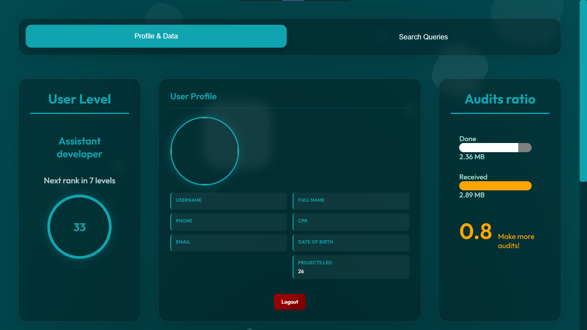
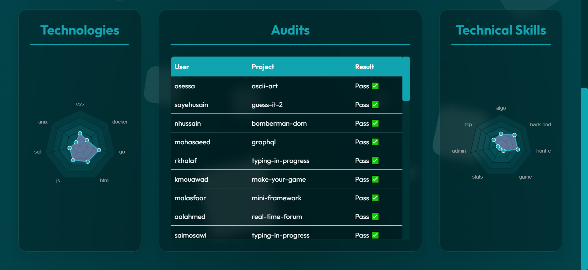
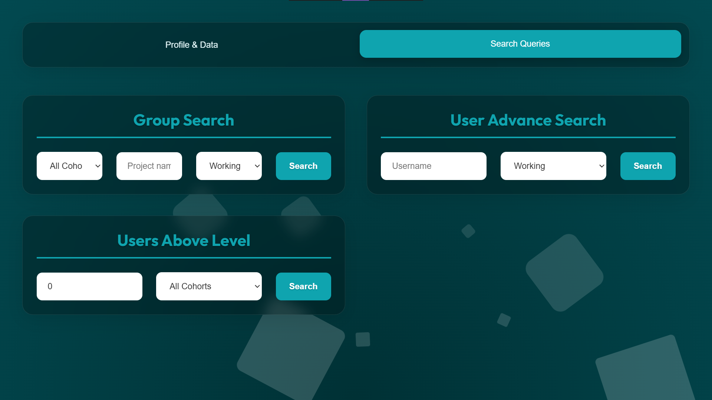
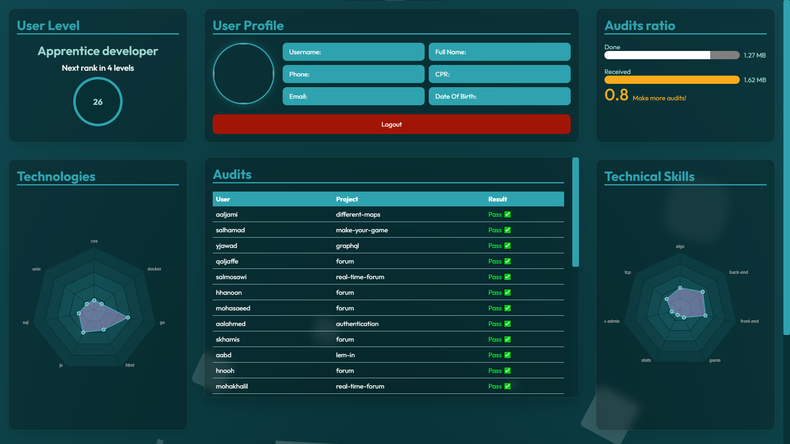
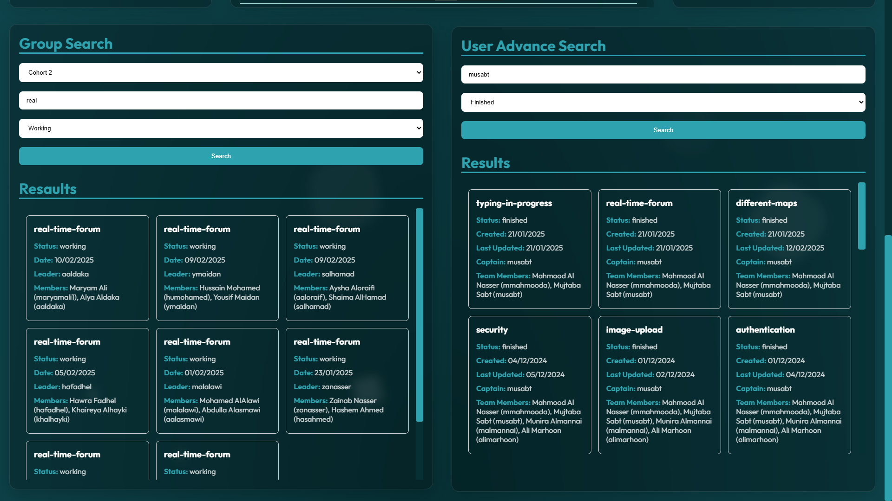

# Student Dashboard v2.0 🚀

A comprehensive dashboard application for tracking student progress and activities in an educational environment. The application is fully responsive and optimized for all devices including desktops, tablets, and mobile phones.

## 🆕 What's New in v2.0
- **Enhanced Group Search**: Now supports searching across all cohorts simultaneously
- **NEW: Users Above Level Search**: Find users above a specific level with cohort filtering options
- **Improved Cohort Management**: Better cohort information display and filtering across all search types
- **Advanced Search Capabilities**: Three comprehensive search engines with flexible filtering
- **Enhanced Data Visualization**: Better organized profile layouts and responsive design improvements

## 📸 Screenshots

### v2.0 Dashboard

*Enhanced dashboard with improved layout and better data organization*,
*Redesigned profile section with better visual hierarchy*

### v2.0 Search Features

*New comprehensive search interface featuring:*
- *"All Cohorts" Group Search functionality*
- *Advanced User Search capabilities*
- *NEW: Users Above Level search with cohort filtering*
- *Enhanced results display with cohort information*

### Previous Version (v1.0)

Click to view v1.0 screenshots

## Features

### User Profile
- Personal information display
- Profile image
- Contact details

### Progress Tracking
- Current level visualization
- Progress to next level
- Interactive progress bars

### Audit Statistics
- Audit ratio display
- Done vs Received audits
- Visual progress tracking

### Technology Skills
- Radar chart for technology proficiency
- Visual representation of technical skills

### Search Features
#### Group Search (Enhanced in v2.0)
- **All Cohorts Search**: Search across all cohorts simultaneously
- Individual cohort selection (Cohort 1-4)
- Project filtering with pattern matching
- Status filtering (finished, in progress, etc.)
- **Comprehensive Results**: Displays cohort information, campus details, and team composition

#### User Search
- Username search
- Status filtering
- Advanced user lookup

#### Users Above Level Search
- Level-based filtering
- Cohort-specific or all-cohorts search
- Detailed user information display

### Responsive Design
- Full mobile responsiveness
- Adaptive layout for tablets and phones
- Optimized UI elements for touch interfaces
- Flexible grid system
- Responsive data visualizations

## Technical Stack
- TypeScript
- HTML5
- CSS3 (with responsive design principles)
- GraphQL

## Setup Instructions
1. Clone the repository
2. Install dependencies: `npm install`
3. Run development server: `npm run dev`

## Changelog

### v2.0.0 (2025-01-XX)
#### 🚀 New Features
- **All Cohorts Group Search**: Added ability to search groups across all cohorts simultaneously
- **Enhanced Cohort Information**: Group search results now display cohort names and campus details
- **Improved Search UI**: Better organized search interface with clearer cohort selection

#### 🔧 Improvements
- Enhanced GraphQL queries for better performance
- Improved responsive design for better mobile experience
- Better error handling and user feedback
- Optimized data visualization components

#### 🐛 Bug Fixes
- Fixed cohort selector variable conflicts
- Improved search result display consistency
- Enhanced mobile responsiveness

### v1.0.0 (Initial Release)
- Basic dashboard functionality
- User profile display
- Progress tracking
- Audit statistics
- Technology skills visualization
- Basic search features

## Author
[@musabt AKA:MAISTRY](https://github.com/MAISTRY)
